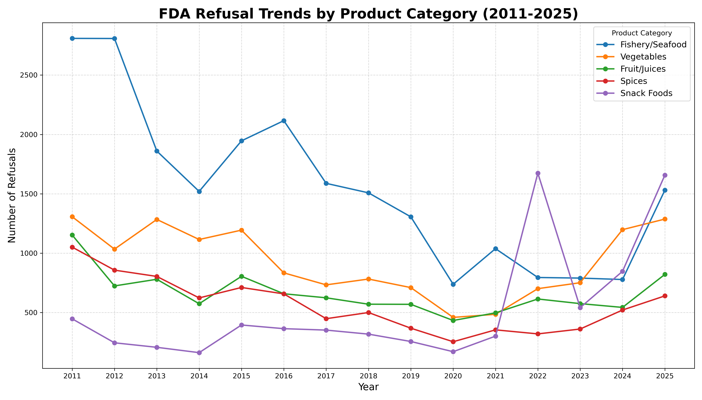
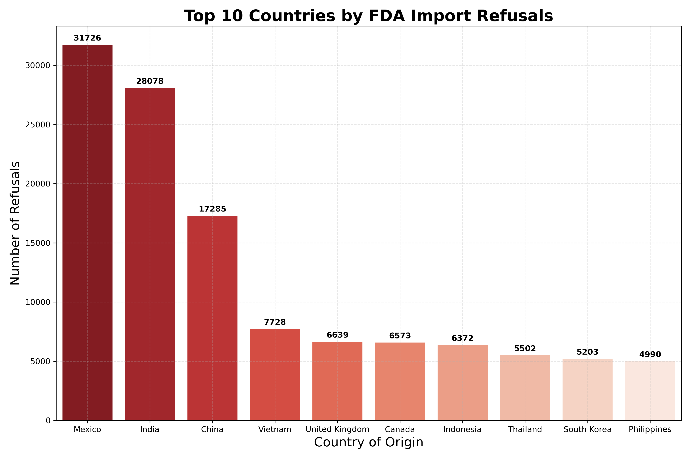
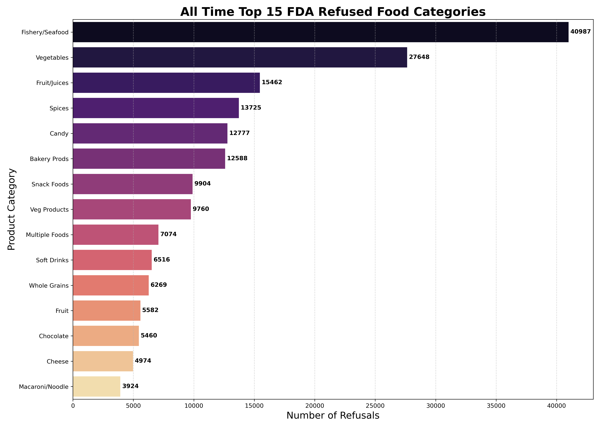
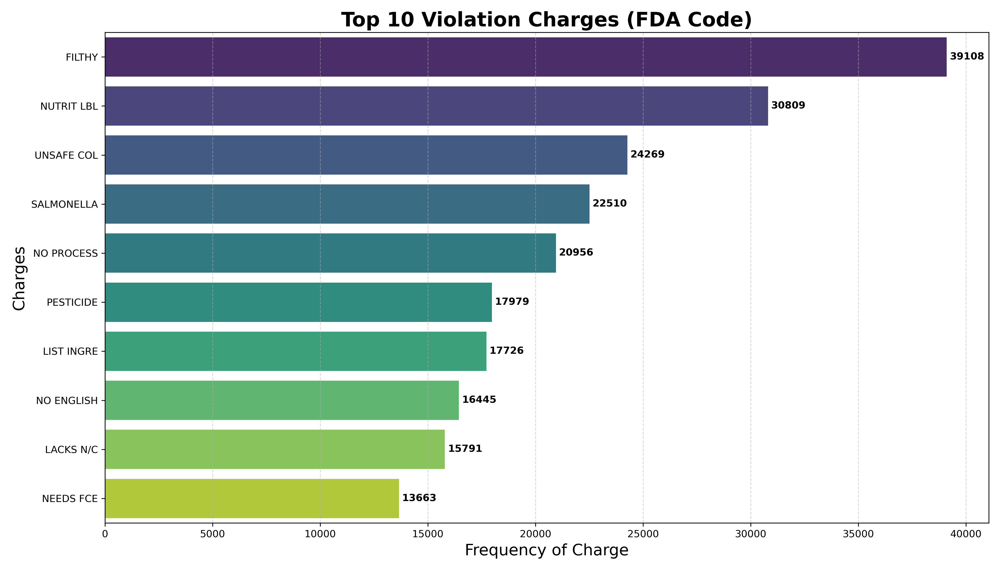

# 🛡️ FDA Import Food Refusal Audit (2001–2025)

**Author:** Md Shafin Ahamed  
**Scope:** Human Food Consumables  
**Tools:** Python, Pandas, Seaborn, NLP  

### Executive Summary
This project audits 25 years of FDA import refusal data to identify systemic risks in the global food supply chain. By analyzing over **205,000 refusal records** (filtered from 500k raw entries), this study isolates high-risk products, geographic hotspots, and specific violation trends.

---

### Key Findings

#### 1. The "Seafood" Outlier
* **Insight:** Fishery/Seafood refusals peaked early (2011-2012) with over 2,800 incidents.
* **Emerging Risk:** Snack foods have surged to become the top refusal category in 2022 & 2025.
* **The COVID Gap:** A massive drop in recorded refusals occurred in 2020 due to reduced border inspections.

#### 2. Geographic Risk
* **Insight:** Despite importing from 188 countries, **Asian nations** (China, India) and **Mexico** dominate the refusal rankings. This suggests a need for targeted supplier verification programs in these regions.

#### 3. Product Vulnerability
* **Insight:** Raw Fish & Seafood refusals are astronomically high compared to Meat.
* **Meat Anomaly:** Raw Meat shows only ~260 refusals (3x less than Baby Food). This indicates that pre-inspection clearance programs (like USDA equivalence) are effectively filtering bad meat shipments *before* they reach the FDA refusal stage.

#### 4. Root Cause (Violation Charges)
* **#1 Filth:** The leading cause of refusal, primarily affecting Fish, Seafood, and Vegetables.
* **#2 Nutrient Mislabeling:** A major administrative failure, predominantly affecting Snacks and Juices.
* **#3 Unsafe Coloring:** Unauthorized additives remain a top-tier issue for processed snacks.

---

### 💻 How to Run
1. Clone the repository.
2. Download data set.
3. Install requirements: `pip install pandas seaborn matplotlib`
4. Run the Jupyter Notebook `FDA_Import_Food_Refusals_Audit.ipynb`.
